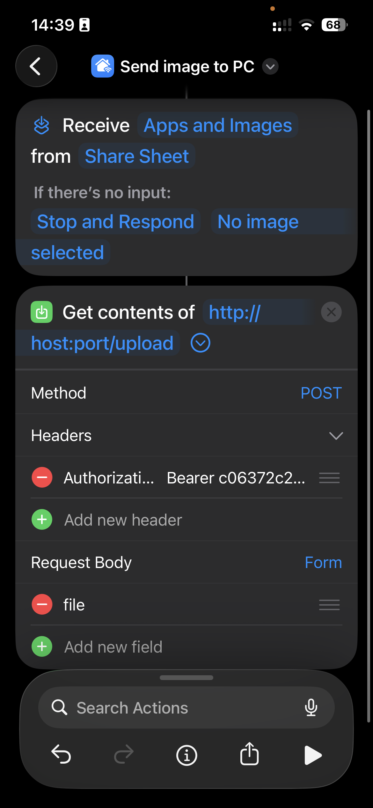
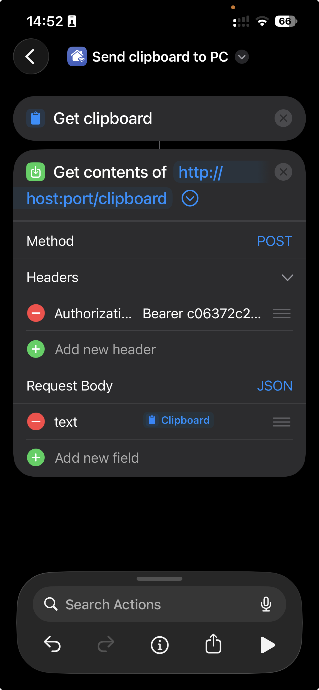
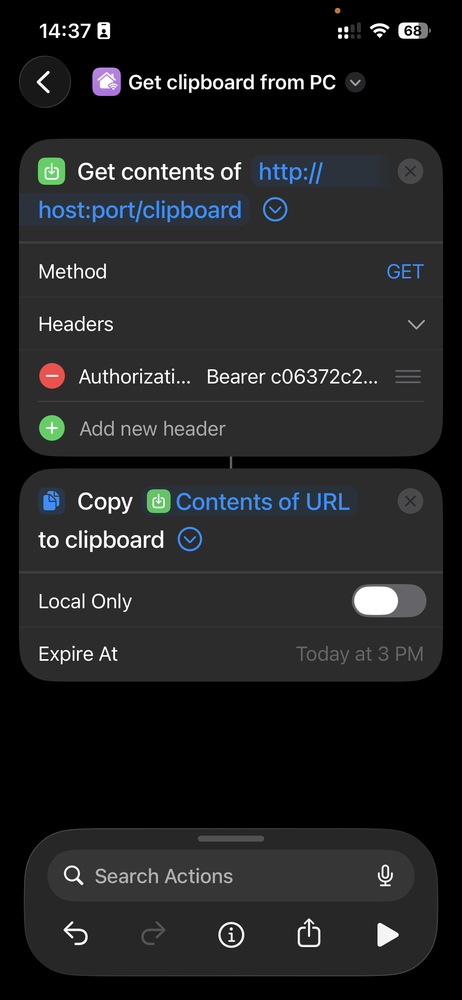

# Piplup

**CAUTION: It not recommended to keep this service open to the web. Use something like Tailscale or keep it local only!** 

Simple API that:

- receives an image via POST request and save it to $HOME/Images/;
- receives a text via POST request and save it to your clipboard;
- receives a GET request and share the host clipboard as a response;

## Requirements

Just use `uv`, do a favor for yourself;

- [`uv`](https://docs.astral.sh/uv/)

## Installation

1. Install dependencies

```bash
uv sync
```

2. Run

```bash
uv run piplup
```

3. Fill .env file

```bash
cp .env.example .env
export SECRET=$(python -c 'import secrets;print(secrets.token_hex(32))')
sed -i "s/\[Your generated secret token\]/$SECRET/g" .env
echo "Your secret is: $SECRET"
echo "\nThe expected authorization header is:\n'Authorization': 'Beaerer $SECRET'"
```

4. Add service to systemd

```bash
mkdir -p ~/.config/systemd/user
cp ./piplup.service ~/.config/systemd/user/piplup.service
sed -i "s/USER/$USER/g; s|/path/to/piplup|$PWD|g" ~/.config/systemd/user/piplup.service
```

5. Start service

```bash
systemctl --user start piplup.service

# Or enable it for auto-run on system startup
systemctl --user enable --now piplup.service
```

- **The default host:port is: `0.0.0.0:6969`**

## Example IOS shortcuts integration

- **Send image to PC**:



- **Send clipboard to PC**:



- **Get clipboard from PC**:


